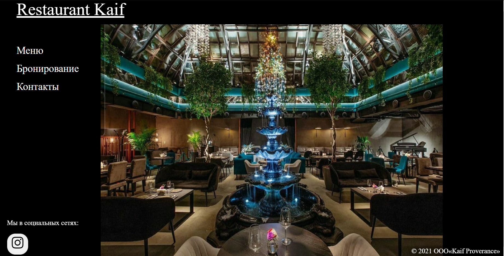
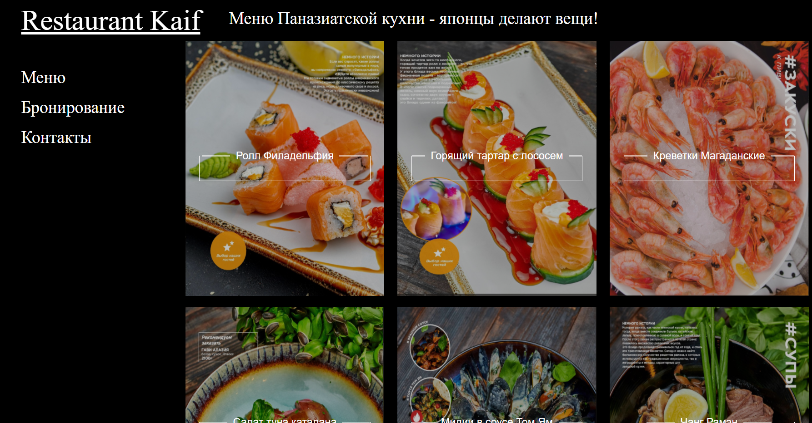
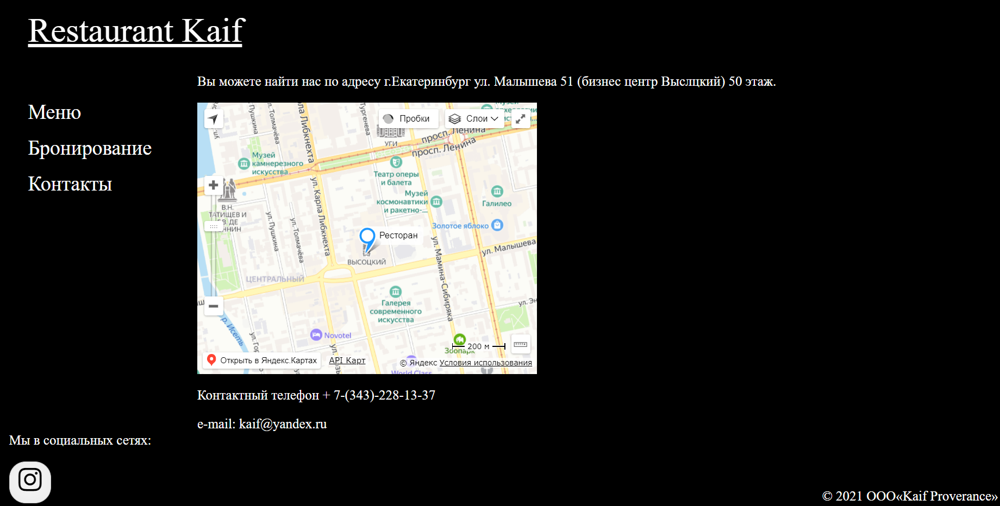
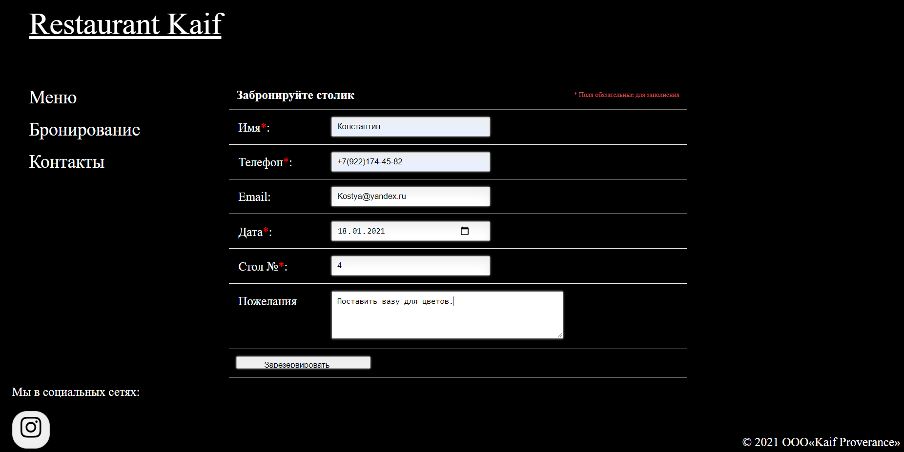
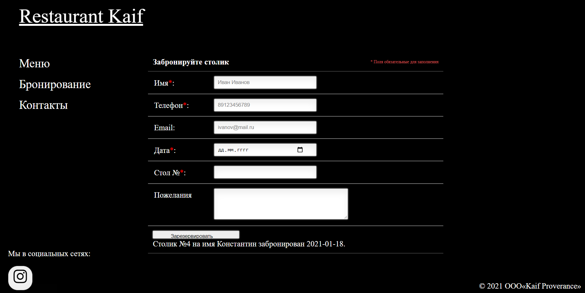
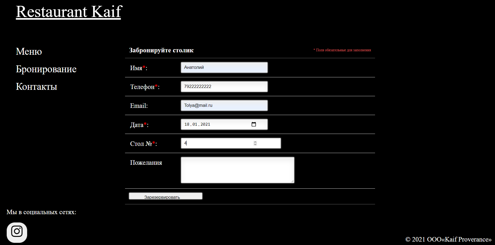
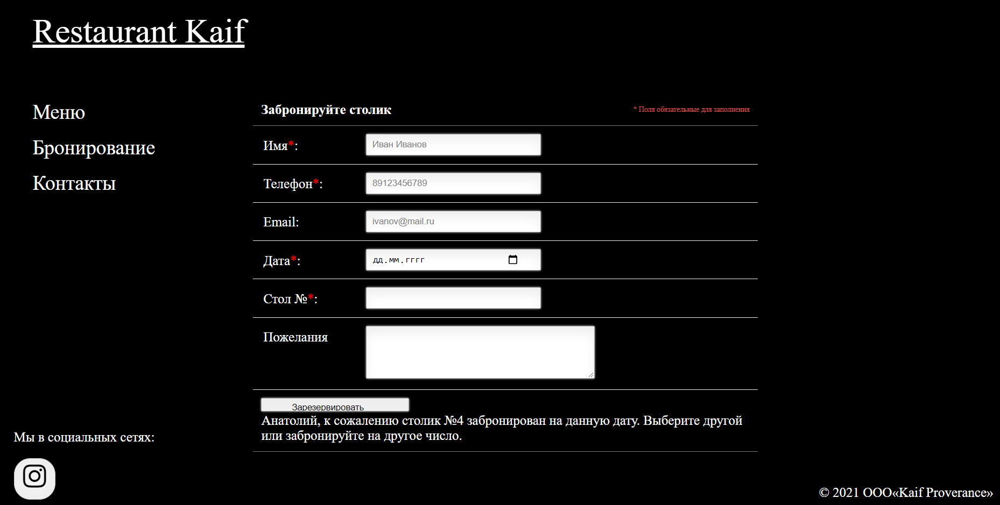

# Restaurant

# dns_server
Задание сайт ресторана с возможностью бронирования столика (Бикоев Константин КН302 МЕН 380207)

Пример запуска:

python main.py

Какой функционал имеет?

1) стартовая страница 

2) Меню

3) Контакты

4) Удачное бронирование:

Снизу появляется подтверждение брони.

5) Неудачное бронирование:

Снизу появляется отказ брони.

